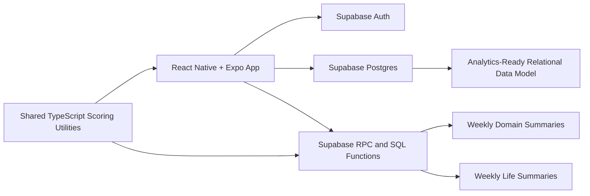

# VELORA Technical Architecture Document

Last updated: 2026-04-03

## 1. Purpose

This document defines the target technical architecture for VELORA Version 1. It describes the system structure, technology stack, backend design, database model, security approach, and operational workflows for the mobile MVP.

Reference documents:
- `/Users/phamvietan/Desktop/Sem1_2026/COMP8715/VELORA/Documentation/scoring-architecture-decisions.md`
- `/Users/phamvietan/Desktop/Sem1_2026/COMP8715/VELORA/Documentation/supabase-sequencing.md`
- `/Users/phamvietan/Desktop/Sem1_2026/COMP8715/VELORA/Documentation/project-charter-prd.md`

## 2. Architecture Goals

The architecture must:
- support a cross-platform mobile app
- keep official score generation backend-authoritative
- preserve strong relational data modeling for analytics
- remain privacy-aware for sensitive personal data
- allow future AI and recommendation features without redesigning the core model

## 3. High-Level System Overview



## 4. Technology Stack

### 4.1 Mobile Application

- React Native
- Expo
- TypeScript
- Expo Router

### 4.2 Backend

- Supabase Auth
- Supabase Postgres
- SQL migrations for schema evolution
- Postgres functions for score logic and orchestration

### 4.3 Shared Logic

- `@velora/shared`
- shared TypeScript utilities for domain constants and score parity

### 4.4 Supporting Tooling

- npm workspaces
- TypeScript
- local Supabase CLI for development

## 5. Architecture Principles

### 5.1 Backend-Authoritative Scoring

Clients capture inputs. The backend validates, normalizes, computes, and persists official scores.

### 5.2 Relational Model First

VELORA prioritizes long-term analytics, trends, and advice generation. The relational database model is therefore a first-class design choice, not an implementation detail.

### 5.3 Separation of Concerns

- feature tables store app-facing content
- normalized action events store score-relevant inputs
- weekly summary tables store official derived outputs

### 5.4 Privacy by Architecture

Sensitive raw content remains separate from derived analytics and score summaries wherever possible.

## 6. Mobile Architecture

### 6.1 App Structure

Recommended structure:

```text
mobile/src/
  app/
  features/
  components/
  lib/
  providers/
```

### 6.2 Navigation

Top-level navigation:
- auth stack
- onboarding stack
- main tabs
- detail screens

Main tabs:
- Home
- Check-In
- Actions
- Summary
- Settings

### 6.3 Mobile Data Boundaries

- Supabase client layer in `mobile/src/lib/supabase`
- auth session boundary in `mobile/src/providers`
- screen modules consume session and backend data through feature-specific service layers

### 6.4 Offline Strategy

VELORA V1 is offline-tolerant:
- cached reads are allowed
- temporary local session persistence is supported
- user input can be queued or retried
- official weekly summaries remain server-confirmed

## 7. Backend Architecture

## 7.1 Core Backend Components

1. Supabase Auth
- user identity
- session tokens
- mobile authentication flows

2. Postgres schema
- profiles
- score-input tables
- feature tables
- summary tables

3. SQL functions
- onboarding completion
- daily check-in submission
- weekly domain summary calculation
- weekly life summary calculation
- orchestration helpers for scheduled summary generation

4. Row Level Security
- protects user-owned data
- restricts client access to their own records
- keeps summary writes backend-owned

## 7.2 Current Backend Workflow Layers

### Layer A: Identity and setup

- `auth.users`
- `profiles`
- `domain_baselines`

### Layer B: Reflection input

- `daily_checkins`

### Layer C: Action input

- `journal_entries`
- `tasks`
- `focus_sessions`
- `activity_logs`
- `sleep_logs`
- `expense_logs`
- `financial_actions`
- `connection_logs`

### Layer D: Normalized score ledger

- `action_events`

### Layer E: Derived weekly summaries

- `weekly_domain_summaries`
- `weekly_life_summaries`

## 8. Database Structure

## 8.1 Core Tables

### Identity and baseline

- `profiles`
- `domains`
- `domain_baselines`

### Reflection

- `daily_checkins`

### Scoring rules and normalized events

- `action_rules`
- `action_events`

### Feature tables

- `journal_entries`
- `tasks`
- `focus_sessions`
- `activity_logs`
- `sleep_logs`
- `expense_logs`
- `financial_actions`
- `connection_logs`

### Summary tables

- `weekly_domain_summaries`
- `weekly_life_summaries`

## 8.2 Key Data Relationships

- one `profiles` row per authenticated user
- one `domain_baselines` row per user and domain
- one `daily_checkins` row per user, domain, and local date
- many feature rows per user
- one normalized `action_events` row per accepted or capped source event
- one `weekly_domain_summaries` row per user, domain, and week
- one `weekly_life_summaries` row per user and week

## 8.3 Important Constraints

- Monday-only `week_start_local_date`
- one daily check-in per domain per day
- unique dedupe constraint on `(user_id, dedupe_key)` in `action_events`
- score range clamping to `0..100`
- bootstrap and observed weights must sum to `1`

## 9. Scoring and Summary Architecture

## 9.1 Reflection Model

- source: `daily_checkins`
- one rating per domain per local day
- missing days ignored
- rating mapped from `1..5` to `20..100`

## 9.2 Action Model

- source: accepted normalized `action_events`
- per-domain weekly target points
- weekly action score capped at `100`

### Weekly action targets

- spirituality: `200`
- family_friends: `200`
- work_productivity: `250`
- health: `300`
- financial_wellbeing: `200`

## 9.3 Consistency Model

For MVP:
- consistency comes from daily check-ins only
- `consistencyDaysCount = reflectionDaysCount`

## 9.4 Domain Score Model

If reflection exists:

```text
CurrentComputedScore = 0.3R + 0.4A + 0.3C
```

If reflection is missing:

```text
CurrentComputedScore = (0.4A + 0.3C) / 0.7
```

## 9.5 Onboarding Blend

During the first 14 days:
- days 1 to 3: `0.7 / 0.3`
- days 4 to 7: `0.4 / 0.6`
- days 8 to 14: `0.2 / 0.8`
- day 15 onward: `0 / 1`

## 9.6 Displayed Score

```text
DisplayedScore_t = 0.7 * PreviousDisplayedScore + 0.3 * BlendedComputedScore_t
```

## 9.7 Life-Level Aggregation

```text
LifeStrength = average(domain displayed scores)
Evenness = clamp(100 - 2 * stddev_pop(domain displayed scores), 0, 100)
BalancedLifeScore = 0.5 * LifeStrength + 0.5 * Evenness
```

## 10. API and Backend Integration Surface

## 10.1 Current RPC and SQL Entry Points

- `complete_onboarding(...)`
- `submit_daily_checkin(...)`
- weekly domain summary helper functions
- weekly life summary helper functions
- weekly summary orchestration helpers

## 10.2 Backend-Only Operations

These should remain server-owned:
- normalized action-event creation
- weekly summary upserts
- previous-week batch orchestration

## 10.3 Mobile-Facing Data Access

The mobile app will need:
- auth session access
- profile reads
- onboarding submission
- daily check-in submission
- feature-table writes
- weekly summary reads

## 11. Security Protocols

## 11.1 Authentication

- Supabase Auth manages sessions and user identity
- mobile sessions persist via AsyncStorage

## 11.2 Authorization

- Row Level Security enabled for user-owned tables
- users can read only their own rows
- normalized score ledgers and weekly summary writes remain backend-owned

## 11.3 Data Protection

- store timestamps in UTC
- use fixed user scoring timezone for score assignment
- keep sensitive raw text separate from normalized score inputs
- do not send raw journaling or note content into generic analytics pipelines

## 11.4 Anti-Gaming Protections

- server-authoritative scoring
- per-action daily caps
- dedupe keys for normalized score events
- capped and rejected events remain auditable
- score-relevant completion transitions are protected from unsafe rewrites

## 11.5 Sensitive Data Handling

Particularly sensitive categories:
- journaling text
- relationship notes
- finance notes
- health notes

Design rule:
- use structured metadata for scoring and analytics
- avoid using private free-text as direct score input

## 12. Responsiveness and Reliability

### 12.1 Performance Expectations

- dashboard and summaries should read from persisted summary tables
- the backend should avoid recomputing full history on every client request

### 12.2 Reliability Requirements

- summary generation must be idempotent
- normalized action creation must tolerate edits without duplicating score input
- daily uniqueness rules must be enforced by schema and backend logic together

### 12.3 Offline-Tolerant Behavior

- mobile app preserves session locally
- feature writes should support retry and pending states
- official summaries should not be fabricated offline

## 13. Observability and Validation

### 13.1 Validation Strategy

- database constraints for hard integrity rules
- SQL functions for trusted score computation
- local Supabase verification for every significant scoring slice
- shared TypeScript parity checks against backend outputs

### 13.2 Auditability

Weekly summaries retain:
- reflection counts
- action points
- target points
- current computed score
- blended score
- displayed score
- provisional status
- strongest and weakest domain keys

## 14. Deployment and Environment Notes

### 14.1 Development

- local Supabase stack via Docker
- local Expo mobile app

### 14.2 Source Structure

```text
Documentation/
mobile/
shared/
supabase/
functions/    temporary legacy scaffold during pivot
```

### 14.3 Current State

The project has already implemented:
- normalized action inputs across all five domains
- weekly domain summary helpers
- weekly life summary helpers
- weekly summary orchestration helpers
- shared score parity utilities
- mobile Supabase client and session boundary

## 15. Next Technical Milestones

- wire mobile auth screens to Supabase Auth
- fetch profile state and onboarding state in mobile
- build onboarding screens on top of the new client
- connect daily check-in UI to backend submission
- add scheduled or server-triggered weekly summary execution path

## 16. Technical Summary

VELORA’s Version 1 architecture is a mobile-first, analytics-friendly, Supabase-based system with backend-authoritative scoring, normalized event inputs, privacy-aware storage boundaries, and a relational foundation designed to support future advice and AI capabilities.
