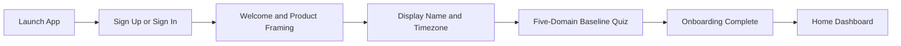
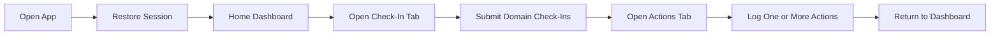
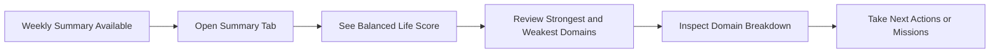

# VELORA UI/UX Design Document

Last updated: 2026-04-03

## 1. Purpose

This document captures the UI/UX direction for VELORA Version 1. It includes:
- design principles
- navigation structure
- user flows
- low-fidelity wireframes
- high-fidelity prototype specifications

It is intended to guide design, implementation, and future Figma work.

## 2. UX Goals

VELORA’s UX should feel:
- simple enough for daily use
- reflective rather than overwhelming
- trustworthy in how it presents scores
- motivating without becoming gamified noise

## 3. Core UX Principles

### 3.1 Clarity First

The app should make the five-domain model easy to understand at a glance.

### 3.2 Daily Friction Must Stay Low

Check-ins and common logs should be fast, obvious, and usable in under a minute.

### 3.3 Weekly Insights Must Feel Meaningful

Weekly summaries should feel like a checkpoint, not just another dashboard number.

### 3.4 Design Should Feel Calm and Structured

The interface should not feel clinical or overly playful. It should create a sense of control, reflection, and progress.

## 4. Navigation Model

### 4.1 Top-Level Navigation

VELORA uses:
- auth stack
- onboarding stack
- main tab navigation
- detail screens pushed from tabs

### 4.2 Recommended Main Tabs

1. `Home`
- balance overview
- strongest and weakest domains
- quick actions

2. `Check-In`
- daily domain reflections

3. `Actions`
- journal
- connection log
- tasks
- focus sessions
- activity logs
- sleep logs
- expense logs
- budget or savings actions

4. `Summary`
- weekly summaries
- history
- domain trends

5. `Settings`
- profile
- timezone
- account actions

## 5. User Flows

### 5.1 First-Time User Flow



### 5.2 Daily Returning User Flow



### 5.3 Weekly Review Flow



## 6. Low-Fidelity Wireframes

## 6.1 Home Dashboard

```text
+--------------------------------------------------+
| VELORA                                           |
| Good evening                                     |
|--------------------------------------------------|
| Balanced Life Score                              |
|                  63.7                            |
|         [ Radar / Wheel Visual ]                 |
|--------------------------------------------------|
| Strongest: Health                                |
| Weakest: Spirituality                            |
|--------------------------------------------------|
| Domain Scores                                    |
| Spirituality            33.3                     |
| Family & Friends        57.1                     |
| Work/Productivity       57.1                     |
| Health                  80.0                     |
| Financial Wellbeing     57.1                     |
|--------------------------------------------------|
| [ Daily Check-In ]  [ Log Action ]  [ Summary ]  |
+--------------------------------------------------+
```

## 6.2 Daily Check-In

```text
+--------------------------------------------------+
| Daily Check-In                                   |
|--------------------------------------------------|
| How are you feeling today in each area?          |
|--------------------------------------------------|
| Spirituality         [1] [2] [3] [4] [5]         |
| Family & Friends     [1] [2] [3] [4] [5]         |
| Work/Productivity    [1] [2] [3] [4] [5]         |
| Health               [1] [2] [3] [4] [5]         |
| Financial            [1] [2] [3] [4] [5]         |
|--------------------------------------------------|
| [ Save Check-In ]                                |
+--------------------------------------------------+
```

## 6.3 Actions Hub

```text
+--------------------------------------------------+
| Actions                                          |
|--------------------------------------------------|
| Spirituality                                     |
| [ Journal ]                                      |
|--------------------------------------------------|
| Family & Friends                                 |
| [ Connection Log ]                               |
|--------------------------------------------------|
| Work/Productivity                                |
| [ Task ] [ Focus Session ]                       |
|--------------------------------------------------|
| Health                                           |
| [ Activity ] [ Sleep ]                           |
|--------------------------------------------------|
| Financial Wellbeing                              |
| [ Expense ] [ Budget/Savings ]                   |
+--------------------------------------------------+
```

## 6.4 Weekly Summary Detail

```text
+--------------------------------------------------+
| Weekly Summary                                   |
| Week of Mar 30 - Apr 5                           |
|--------------------------------------------------|
| Balanced Life Score: 63.7                        |
| Life Strength: 56.9                              |
| Evenness: 70.5                                   |
|--------------------------------------------------|
| Strongest Domain: Health                         |
| Weakest Domain: Spirituality                     |
|--------------------------------------------------|
| Domain Breakdown                                 |
| Spirituality            33.3                     |
| Family & Friends        57.1                     |
| Work/Productivity       57.1                     |
| Health                  80.0                     |
| Financial Wellbeing     57.1                     |
|--------------------------------------------------|
| [ View History ] [ Take Action ]                 |
+--------------------------------------------------+
```

## 7. High-Fidelity Prototype Specification

This section defines the intended high-fidelity design direction so it can be translated into visual mockups or Figma screens.

## 7.1 Visual Direction

### Tone

The interface should feel:
- calm
- modern
- grounded
- structured

### Color Direction

Recommended palette direction:
- background: deep slate or charcoal
- card surfaces: muted dark-neutral or warm off-white variant depending on theme direction
- primary accent: soft blue or teal for trusted system states
- positive emphasis: green for healthy upward movement
- warning emphasis: amber for missing or weak areas

Avoid:
- highly saturated neon palettes
- overly playful gamification colors
- purple-heavy generic wellness styling

### Typography Direction

- clear, modern sans-serif
- strong hierarchy for score numbers and section labels
- compact but readable body text

### Shape and Layout Direction

- rounded cards
- generous spacing
- clear section separation
- visual emphasis on score summaries and next actions

## 7.2 High-Fidelity Screen Specifications

### Screen A: Home Dashboard

Key design elements:
- large hero score at the top
- circular or radar visualization directly below the score
- strongest and weakest domain highlight card
- domain score list with consistent ordering
- quick-action buttons anchored high enough for immediate use

Navigation behavior:
- tap domain row opens domain detail in a future iteration
- quick actions route to check-in or action entry screens

### Screen B: Onboarding Quiz

Key design elements:
- welcome screen with short explanation of balance model
- one domain rating section at a time or a compact five-domain stepper
- supportive microcopy so the user understands these are starting estimates
- clear progress indicator

Navigation behavior:
- forward-only flow until completion
- submit action leads directly into the main app

### Screen C: Daily Check-In

Key design elements:
- one domain row per check-in target
- large touch-friendly rating chips or segmented controls
- instant visual confirmation of selected rating
- concise save action and clear completion feedback

Navigation behavior:
- allow leaving and returning without losing entered state during the same session
- if a check-in already exists for the day, show edit state rather than duplicate entry state

### Screen D: Actions Hub

Key design elements:
- grouped by domain
- simple list or stacked cards
- each action tool clearly labeled by purpose

Navigation behavior:
- each tile pushes to a dedicated logging screen
- hub acts as the central operational screen for daily improvement actions

### Screen E: Weekly Summary

Key design elements:
- large weekly score hero
- explanation of life strength and evenness
- strongest and weakest domain highlights
- five domain breakdown blocks
- suggested next steps or missions below the score breakdown

Navigation behavior:
- summary list opens detail
- detail links back to home and actions

## 8. Interaction Design Notes

### Loading states

- skeletons for dashboard cards
- inline loading indicators for saves and refresh

### Error states

- clear short messages
- do not expose raw backend errors to users

### Empty states

- explain what the user needs to do next
- example: “Complete your first check-in to start building your weekly score”

### Offline-tolerant states

- show pending sync state for unsynced entries
- keep official weekly summary labels clearly server-confirmed

## 9. Responsive Design Guidance

- design for phone-first portrait usage
- support small and large phone widths without clipped content
- maintain readable charts and lists on narrow devices
- keep primary actions visible without excessive scrolling

## 10. Future UX Extensions

This design system should be extensible for:
- AI advice cards
- social/community screens
- photo features
- trend analytics
- richer domain detail pages

## 11. UI/UX Summary

VELORA’s UX should feel focused and confidence-building. Daily entry flows should be fast and lightweight, while weekly review screens should feel substantial, reflective, and clearly tied to the five-domain balance model.
